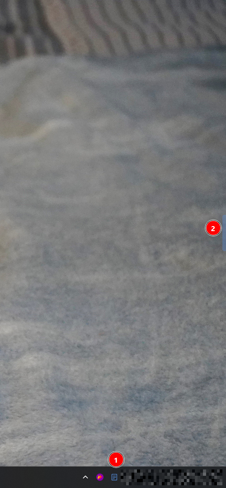

<p align="center">
  
</p>

<h1 align="center">NoteTray</h1>

<p align="center">
  A lightweight, always-accessible note-taking app that lives in your Windows system tray.
</p>

<p align="center">
  <a href="https://cbullers.github.io/NoteTray/">Website</a> &middot;
  <a href="#features">Features</a> &middot;
  <a href="#installation">Installation</a> &middot;
  <a href="#usage">Usage</a>
</p>

---

## Features

- **System tray app** — runs quietly in the background, never cluttering your taskbar
- **Slide-in panel** — appears from the screen edge with a smooth animation
- **Global hotkey** — summon your notes instantly with `Ctrl+Shift+.` (configurable)
- **Grab bar** — a subtle edge handle that follows your cursor across monitors
- **Folder organization** — group notes into folders with a dropdown selector
- **Markdown notes** — write in plain text, preview rendered markdown
- **Search** — filter notes instantly as you type
- **Note colors** — color-code notes for quick visual scanning
- **Resizable panel** — drag the left edge to adjust panel width
- **Multi-monitor support** — grab bar and panel track your active monitor
- **Persistent storage** — notes saved as `.md` files in your AppData folder
- **Start with Windows** — optional auto-launch on login
- **Dark theme** — easy on the eyes with a polished dark UI

## Screenshots

<p align="center">
  
  &nbsp;&nbsp;
  
  &nbsp;&nbsp;
  
</p>

## Installation

### Requirements

- Windows 10 or later
- [.NET 8.0 Runtime](https://dotnet.microsoft.com/download/dotnet/8.0)

### Build from source

```bash
git clone https://github.com/cbullers/NoteTray.git
cd NoteTray
dotnet build NoteTray/NoteTray.csproj -c Release
```

The compiled executable will be in `NoteTray/bin/Release/net8.0-windows/`.

### Run

```bash
dotnet run --project NoteTray/NoteTray.csproj
```

## Usage

| Action | How |
|---|---|
| Open/close panel | `Ctrl+Shift+.` or click the grab bar |
| Create a note | Click the **+** button in the header |
| Create a folder | Click the folder **+** button |
| Switch folders | Use the dropdown in the header |
| Search notes | Type in the search bar (visible in list view) |
| Preview markdown | Click the eye icon while editing |
| Resize panel | Drag the left edge of the panel |
| Exit | Right-click the tray icon and select **Exit** |

### Configuration

Settings are stored at `%AppData%\NoteTray\settings.json`:

| Setting | Default | Description |
|---|---|---|
| `Hotkey` | `Ctrl+Shift+.` | Global keyboard shortcut |
| `GrabBarEnabled` | `true` | Show the edge grab bar |
| `GrabBarSide` | `Right` | Screen edge (`Right` or `Left`) |
| `PanelWidth` | `350` | Panel width in pixels |
| `AnimationDurationMs` | `200` | Slide animation duration |
| `StartWithWindows` | `false` | Launch on Windows startup |

### Data storage

Notes are stored as plain markdown files:

```
%AppData%\NoteTray\
  settings.json          # App settings
  index.json             # Folder & note metadata
  notes/
    {guid}.md            # Individual note files
```

## Tech Stack

- **WPF** on .NET 8
- **MVVM** architecture
- [Hardcodet.NotifyIcon.Wpf](https://github.com/hardcodet/wpf-notifyicon) — system tray integration
- [NHotkey](https://github.com/thomaslevesque/NHotkey) — global hotkey registration
- [FontAwesome.Sharp](https://github.com/awesome-inc/FontAwesome.Sharp) — UI icons

## License

MIT License. See [LICENSE](LICENSE) for details.
